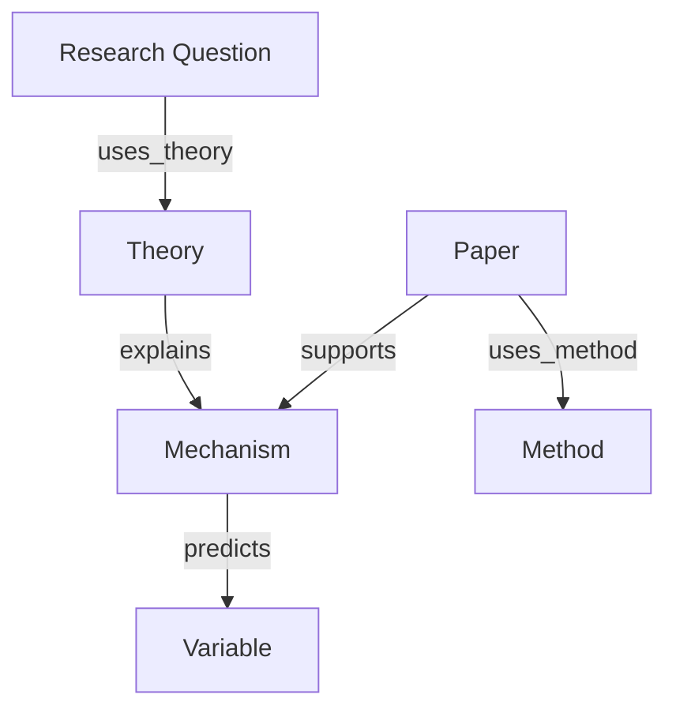

# 第 04 讲：Zotero / Obsidian 长期知识库

副标题：让文献、论文卡片、理论变量方法矩阵和研究问题图谱长期复用

## 一、课程定位

前三讲已经完成：

- 第 01 讲：Agent、Skills、MCP、模型、渠道的基础设施。
- 第 02 讲：PDF、Word、Excel、PPT 等文档进入结构化工作流。
- 第 03 讲：真实文献检索、BibTeX、PDF、AMiner、AI4Scholar 和飞书日报。

第四讲解决一个更长期的问题：文献越读越多以后，如何防止资料再次变乱。

本讲核心原则：

```text
Zotero 管“文献事实”，Obsidian 管“研究理解”，矩阵管“可比较结构”，知识图谱管“问题关系”。
```

不能把 Zotero 当笔记库，也不能把 Obsidian 当文献数据库。两者分工清楚，知识库才能长期维护。

建议课时：4 小时。

## 二、本讲模板

### 这节课解决什么科研问题和需求

本讲解决 7 类问题：

1. 文献越来越多，学生不知道哪些读过、哪些没读、哪些可引用。
2. PDF 下载到本地，但 Zotero 条目、PDF、BibTeX 和笔记没有对应。
3. Obsidian 笔记只是摘抄，没有理论、变量、方法和启发。
4. 文献综述时找不到某个理论、量表、方法来自哪篇论文。
5. 学生每次写论文都重新找文献，不能复用既有阅读成果。
6. 研究问题之间没有图谱，读文献无法沉淀成选题。
7. Agent 生成的文献卡片没有进入长期知识库。

本讲目标：学生完成一个可运行的 Zotero / Obsidian 知识库骨架，并至少导入 10 篇文献、生成 3 张 Obsidian 论文卡片、1 张理论-变量-方法矩阵、1 个研究问题知识图谱。

### 需要哪些 Skills

推荐复制以下 Skills：

| 功能 | Skills | 用途 |
|---|---|---|
| Zotero 同步 | `zotero-library-sync`, `pyzotero` | 读取 Zotero 条目、导出元数据、BibTeX、附件状态 |
| Obsidian 卡片 | `obsidian-paper-card` | 每篇论文生成结构化 Markdown note |
| 理论变量方法矩阵 | `theory-variable-method-matrix` | 汇总理论、机制、变量、方法、样本、结果 |
| 研究问题图谱 | `research-question-knowledge-graph` | 构建研究问题、理论、变量、方法、论文的关系图 |
| 可复用启发库 | `paper-reusable-insight-bank` | 沉淀可迁移理论、方法、实验和写作启发 |
| 引用核验 | `citation-management`, `ai4scholar-auto-citation-bibtex` | 核验 DOI/BibTeX/引用 |
| 文档处理 | `pdf`, `markitdown`, `xlsx` | 读取 PDF、生成矩阵和表格 |

复制命令：

```powershell
cd "<本项目路径>\本地Skills功能分类库"

powershell -ExecutionPolicy Bypass -File .\00_工具脚本\copy_skill_to_workspace.ps1 `
  -SkillName zotero-library-sync,obsidian-paper-card,theory-variable-method-matrix,research-question-knowledge-graph,paper-reusable-insight-bank,citation-management,pdf,markitdown,xlsx `
  -Workspace "D:\AI科研训练营\第04讲_知识库工作区"
```

`pyzotero` 如果已安装在 Agent 全局 Skills，可直接使用；课堂讲 API Key 配置，不要求每个学生必须现场写回 Zotero。

### 输入材料是什么

课堂输入：

| 输入 | 要求 |
|---|---|
| Zotero 软件 | 已安装并可打开 |
| Zotero Connector | 浏览器插件，便于保存网页/论文 |
| Obsidian 软件 | 已安装并能创建 Vault |
| 10 篇文献 | 可来自第三讲候选文献和 PDF |
| 3 篇核心论文 | 用于生成 Obsidian 论文卡片 |
| Zotero API Key | 可选；没有也可手动导出 BibTeX/CSV |
| Better BibTeX | 推荐，用于稳定 citation key 和自动导出 |
| 研究主题 | 例如：AI agent 在科研工作流中的应用 |

安全要求：

```text
ZOTERO_API_KEY 不写入作业、PPT、飞书、Git、Obsidian 公共 vault。
```

### Agent 应该怎么执行

第四讲采用 12 步执行流：

1. 安装 Zotero 和浏览器 Connector。
2. 安装 Obsidian 并创建 Vault。
3. 设计 Zotero Collection 和 Tag 体系。
4. 导入 10 篇文献并补齐元数据。
5. 安装或配置 Better BibTeX，生成稳定 citekey。
6. 导出 Zotero 条目为 BibTeX / CSV / JSON。
7. 用 `zotero-library-sync` 审计缺 DOI、缺 PDF、重复条目和未打标签项。
8. 为 3 篇核心论文生成 Obsidian 论文卡片。
9. 用 Obsidian 双链连接理论、变量、方法、项目和论文。
10. 生成理论-变量-方法矩阵。
11. 生成研究问题知识图谱和 Mermaid 图。
12. 建立每日知识库维护流程。

### 输出文件应该长什么样

| 输出 | 内容 | 合格标准 |
|---|---|---|
| `zotero_exports/zotero_items.csv` | Zotero 文献元数据 | 至少 10 篇文献 |
| `zotero_exports/references.bib` | BibTeX | citation key 稳定、不重复 |
| `zotero_exports/metadata_audit.xlsx` | 元数据审计 | 缺 DOI、缺 PDF、重复、未打标签 |
| `obsidian_vault/01_Papers/*.md` | Obsidian 论文卡片 | 至少 3 张，含 YAML 和链接 |
| `matrices/theory_variable_method_matrix.xlsx` | 理论变量方法矩阵 | 至少 10 行 |
| `graphs/research_question_graph.md` | 研究问题知识图谱 | 有节点、边、Mermaid 图 |
| `reusable_insights/paper_reusable_insight_bank.md` | 可复用启发库 | 至少 5 条具体启发 |
| `qc/knowledge_base_audit.md` | 知识库核验清单 | 标注元数据、引用、PDF、笔记风险 |
| `research_log.md` | 执行日志 | 记录今天导入、制卡、矩阵和待核验项 |

### 哪些地方必须人工核验

| 风险 | 必须核验 |
|---|---|
| Zotero 元数据 | 题名、作者、年份、期刊、DOI 是否真实 |
| PDF 附件 | 是否与 Zotero 条目匹配 |
| Better BibTeX citekey | 是否唯一、稳定、可读 |
| Obsidian 卡片 | 是否混淆论文原意和个人推断 |
| 理论机制 | 是否只是贴理论标签 |
| 变量和测量 | 是否把构念和测量混为一谈 |
| 知识图谱边 | 每条边是否有论文或笔记证据 |
| API Key | 是否泄露到 vault、作业或共享文件 |

### 学生课后作业

提交：

```text
姓名_第04讲_Zotero_Obsidian长期知识库
```

必须包含：

1. Zotero Collection 和 Tag 截图或导出说明。
2. 至少 10 篇文献的 `zotero_items.csv`。
3. `references.bib`。
4. 至少 3 张 Obsidian 论文卡片。
5. 1 张理论-变量-方法矩阵。
6. 1 个研究问题知识图谱。
7. 1 份可复用启发库。
8. 1 份知识库审计清单。
9. `research_log.md`。
10. 300 字反思：Zotero 和 Obsidian 的分工是什么，为什么不能混用。

## 三、软件与插件说明

### 1. Zotero

官方入口：

```text
https://www.zotero.org/download/
```

建议安装：

- Zotero 桌面端。
- Zotero Connector 浏览器插件。
- Better BibTeX 插件。

Zotero 负责：

- 文献条目。
- DOI、作者、期刊、年份等元数据。
- PDF 附件。
- Collection 分类。
- Tags 标签。
- BibTeX / CSL-JSON 导出。

### 2. Obsidian

官方入口：

```text
https://obsidian.md/download
```

Obsidian 负责：

- 论文卡片。
- 理论笔记。
- 变量笔记。
- 方法笔记。
- 项目笔记。
- 双向链接。
- 研究问题图谱。

### 3. Better BibTeX

用途：

- 稳定 citation key。
- BibTeX 自动导出。
- 保持 Zotero 与论文写作引用一致。

建议 citekey 格式：

```text
auth.lower + year + shorttitle(3,3)
```

示例：

```text
smith2024aitrust
```

### 4. Obsidian Zotero Integration

用途：

- 从 Zotero 条目生成 Obsidian note。
- 通过模板把元数据、摘要、注释写入 Markdown。
- 适合把第三讲的文献池转为长期卡片。

注意：插件版本会更新，课堂只给配置逻辑，具体界面以当前版本为准。

## 四、Zotero 结构设计

### 1. Collection 结构

推荐结构：

```text
00_inbox
01_to_read
02_reading
03_core_theory
04_methods
05_measures
06_datasets
07_reviews_meta
08_manuscript_citations
09_daily_literature
99_archive
```

解释：

- `00_inbox`：刚收进来的文献，未清理。
- `01_to_read`：未来要读。
- `02_reading`：正在读。
- `03_core_theory`：理论源文献。
- `04_methods`：方法源文献。
- `05_measures`：量表、测量和变量操作化。
- `06_datasets`：数据集、语料、平台。
- `07_reviews_meta`：综述和 meta-analysis。
- `08_manuscript_citations`：当前论文要引用的文献。
- `09_daily_literature`：第三讲每日文献日报导入内容。
- `99_archive`：已归档。

### 2. Tag 体系

字段标签：

```text
field:management
field:psychology
field:neuroscience
field:bci
field:hci
```

方法标签：

```text
method:eeg
method:erp
method:scenario_experiment
method:text_mining
method:machine_learning
method:deep_learning
method:causal_inference
```

角色标签：

```text
role:classic
role:must_read
role:method_source
role:measure_source
role:theory_source
```

状态标签：

```text
status:to_read
status:read
status:verified
status:needs_check
```

## 五、Obsidian Vault 结构设计

推荐结构：

```text
obsidian_vault/
├─ 00_Inbox/
├─ 01_Papers/
├─ 02_Theories/
├─ 03_Variables/
├─ 04_Methods/
├─ 05_Projects/
├─ 06_Matrices/
├─ 07_Graphs/
├─ 08_Templates/
└─ 99_Archive/
```

角色分工：

- `01_Papers`：一篇论文一张卡。
- `02_Theories`：理论解释机制。
- `03_Variables`：变量定义、测量、量表、操作化。
- `04_Methods`：实验、EEG、文本挖掘、因果推断等方法。
- `05_Projects`：自己的论文、课题、投稿项目。
- `06_Matrices`：理论-变量-方法矩阵。
- `07_Graphs`：研究问题知识图谱。
- `08_Templates`：模板。

## 六、论文卡片标准

每张卡片命名：

```text
@FirstAuthorYear_ShortTitle.md
```

示例：

```text
@Smith2024_AITrust.md
```

必须包含 YAML：

```yaml
---
zotero_key:
citation_key:
title:
authors:
year:
venue:
doi:
fields: []
methods: []
theories: []
variables: []
status: to_read
verification_status: unverified
---
```

卡片主体必须回答：

- 这篇论文解决什么问题。
- 它使用什么理论解释机制。
- 变量如何定义和测量。
- 使用什么方法和数据。
- 关键结果是什么。
- 局限是什么。
- 对我的项目有什么可复用价值。
- 哪些内容必须人工核验。

## 七、理论-变量-方法矩阵

矩阵作用：

- 快速找到某个理论对应哪些变量。
- 快速找到某个变量用过哪些测量。
- 快速找到某类方法在顶刊中的用法。
- 快速发现理论缺口、测量缺口和方法缺口。

最小字段：

```text
paper_id
zotero_key
citation_key
research_question
theory
mechanism
construct
variable_role
variable_name
definition
measurement
method_design
sample_data
analysis_model
key_result
limitations
reuse_for_my_project
verification_status
note_link
```

关键要求：

- 理论必须写机制，不只写理论名。
- 构念和变量测量必须分开。
- 一篇论文可以有多行。
- 每一行必须能回到 Zotero 或 Obsidian note。

## 八、研究问题知识图谱

知识图谱不是为了好看，而是为了看清：

- 哪些理论在解释哪些机制。
- 哪些变量被哪些论文测量过。
- 哪些方法支持哪些结论。
- 哪些研究缺口是真缺口，哪些只是没读到。

节点类型：

```text
paper, author, venue, theory, mechanism, construct, variable, method, dataset, measure, research_question, hypothesis, finding, limitation, project, idea
```

边类型：

```text
cites, supports, contradicts, uses_theory, tests_mechanism, measures, uses_method, uses_dataset, published_in, authored_by, extends, has_gap, informs_hypothesis, belongs_to_project
```

Mermaid 示例：



## 九、课堂实操流程

### 实操 1：安装和账号

1. 下载 Zotero。
2. 安装 Zotero Connector。
3. 创建或登录 Zotero 账号。
4. 打开 Zotero 同步设置。
5. 下载 Obsidian。
6. 创建本地 Vault。

### 实操 2：创建知识库工作区

```powershell
New-Item -ItemType Directory -Force -Path "D:\AI科研训练营\第04讲_知识库工作区"
cd "D:\AI科研训练营\第04讲_知识库工作区"

New-Item -ItemType Directory -Force -Path configs,zotero_exports,obsidian_vault,matrices,graphs,reusable_insights,qc,output,skills
New-Item -ItemType Directory -Force -Path obsidian_vault\00_Inbox,obsidian_vault\01_Papers,obsidian_vault\02_Theories,obsidian_vault\03_Variables,obsidian_vault\04_Methods,obsidian_vault\05_Projects,obsidian_vault\06_Matrices,obsidian_vault\07_Graphs,obsidian_vault\08_Templates,obsidian_vault\99_Archive
New-Item -ItemType File -Force -Path AGENTS.md,research_log.md
```

### 实操 3：复制 Skills

```powershell
cd "<本项目路径>\本地Skills功能分类库"

powershell -ExecutionPolicy Bypass -File .\00_工具脚本\copy_skill_to_workspace.ps1 `
  -SkillName zotero-library-sync,obsidian-paper-card,theory-variable-method-matrix,research-question-knowledge-graph,paper-reusable-insight-bank,citation-management,pdf,markitdown,xlsx `
  -Workspace "D:\AI科研训练营\第04讲_知识库工作区"
```

### 实操 4：整理 Zotero

学生在 Zotero 中完成：

1. 新建 Collection。
2. 导入至少 10 篇文献。
3. 每篇文献检查题名、作者、年份、期刊、DOI。
4. 至少 5 篇有 PDF 附件。
5. 为每篇文献打至少 3 个标签。
6. 导出 BibTeX 或 CSV。

### 实操 5：配置 Zotero API

如果使用 API：

```text
https://www.zotero.org/settings/keys
```

环境变量示例：

```text
ZOTERO_LIBRARY_ID=your_user_or_group_id
ZOTERO_LIBRARY_TYPE=user
ZOTERO_API_KEY=your_private_key
```

没有 API Key 也可以手动导出 BibTeX/CSV，先完成课堂流程。

### 实操 6：审计 Zotero 文献库

提示词：

```text
Use zotero-library-sync to audit my Zotero library export.
Do not display API keys.
Export zotero_items.csv, references.bib, metadata_audit.xlsx, and obsidian_paper_index.md.
Check missing DOI, duplicate titles, missing PDF attachments, untagged items, and inconsistent venue names.
Do not write changes back to Zotero.
```

### 实操 7：创建 Obsidian Vault

打开 Obsidian：

1. `Open folder as vault`。
2. 选择：

```text
D:\AI科研训练营\第04讲_知识库工作区\obsidian_vault
```

3. 把模板复制到：

```text
obsidian_vault/08_Templates/obsidian_paper_note_template.md
```

### 实操 8：生成 3 张论文卡片

提示词：

```text
Use obsidian-paper-card to create Obsidian notes for three core papers.
Use obsidian_paper_note_template.md.
Each note must include YAML frontmatter, citation, one-sentence takeaway, research question, theory mechanism, variables, method, data/sample, key results, limitations, reusable ideas, and links.
Separate paper evidence from my interpretation.
Output notes to obsidian_vault/01_Papers/.
```

### 实操 9：建立理论/变量/方法笔记

为每个核心理论、变量、方法创建单独 note：

```text
obsidian_vault/02_Theories/Technology_Acceptance.md
obsidian_vault/03_Variables/Trust_in_AI.md
obsidian_vault/04_Methods/Scenario_Experiment.md
```

在论文卡片中使用链接：

```text
[[Technology_Acceptance]]
[[Trust_in_AI]]
[[Scenario_Experiment]]
```

### 实操 10：生成理论-变量-方法矩阵

提示词：

```text
Use theory-variable-method-matrix to build a matrix from my Obsidian paper cards.
Extract theory, mechanism, constructs, variable roles, measurement, method design, sample, analysis model, key result, limitations, and reuse_for_my_project.
Export matrices/theory_variable_method_matrix.xlsx and matrices/theory_variable_method_matrix.md.
Do not treat theories as decorative labels.
```

### 实操 11：生成研究问题知识图谱

提示词：

```text
Use research-question-knowledge-graph to build a knowledge graph for my research question.
Use Zotero items and Obsidian paper cards as sources.
Return node tables, typed edges, a Mermaid graph, and gap candidates requiring verification.
Output graphs/research_question_graph.md and graphs/research_question_edges.xlsx.
```

### 实操 12：建立可复用启发库

提示词：

```text
Use paper-reusable-insight-bank to extract reusable insights from the three paper cards and the matrix.
Separate reusable theory, variables, methods, experiment designs, EEG/ERP/BCI ideas, text-mining ideas, and writing/rebuttal ideas.
Output reusable_insights/paper_reusable_insight_bank.md.
```

## 十、第四讲验收标准

| 等级 | 标准 |
|---|---|
| 合格 | Zotero 10 篇文献、Obsidian Vault、3 张论文卡片 |
| 良好 | 有 Zotero 审计、BibTeX、理论-变量-方法矩阵 |
| 优秀 | 有研究问题知识图谱、可复用启发库、每日维护流程和人工核验记录 |

## 十一、与后续课程的连接

第四讲产出会用于：

- 第 05 讲：文献综述和研究问题生成。
- 第 07 讲：情景实验和量表选择。
- 第 08 讲：数据分析与因果推断。
- 第 10-11 讲：EEG/ERP 和 BCI 文献方法复用。
- 第 12 讲：论文写作、引用和投稿。
