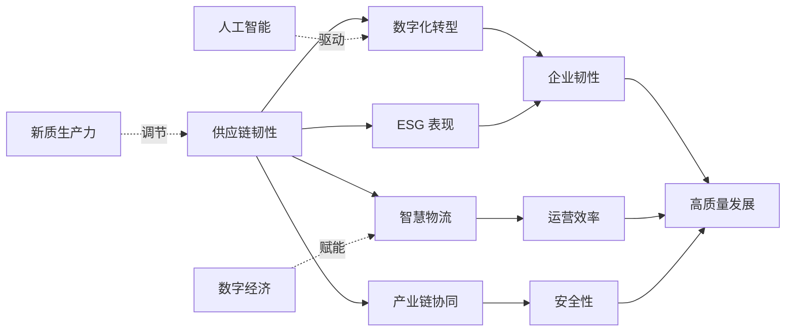
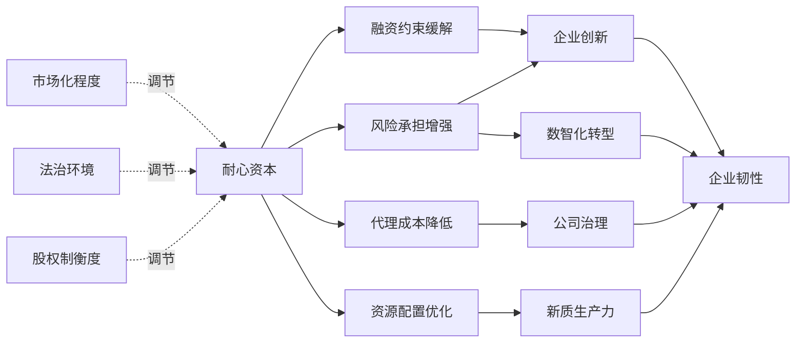
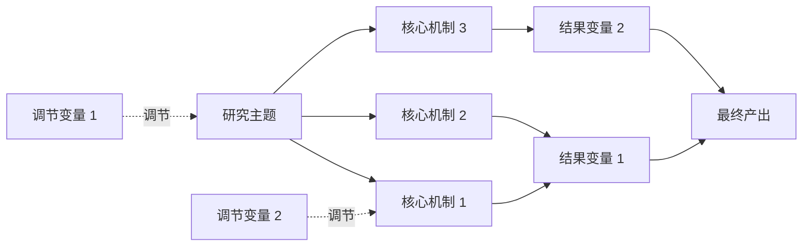

# ⚠️ 首次运行必读

**如果您第一次使用本技能，请先完成依赖检查:**

```bash
# 1. 运行依赖检查脚本
python scripts/check_dependencies.py

# 2. 根据提示安装缺失的依赖
# 3. 配置数据库连接
# 4. 再次运行检查，确保所有依赖就绪
```

**依赖检查通过后，可删除本提示章节。**

---

# Literature Reviewer Skill (v5.2 存储重构版)

**架构原则:** 脚本主导，数据隔离

- **Phase 0-8 (数据处理 + 分析):** Python 脚本 100% 主导
- **Phase 9-10 (知识生产):** 大模型辅助
- **核心改进 (v5.2):** 每个会话完全独立的数据存储 + 主题专用理论框架图

**数据隔离保证:**
- ✅ 每个会话唯一 session_id（时间戳 + 主题）
- ✅ CNKI 爬取后立即导出到会话目录
- ✅ 后续分析只使用本会话数据文件
- ✅ 数据库仅作为临时存储，爬取后清空
- ✅ 不同会话数据完全隔离，不会混淆

**版本演进:**
- v2.0: 基础 8 阶段工作流
- v5.0: 新增文献计量、方法论评价、演进分析
- v5.1: 统计计算全部脚本化，演进分析完全动态化
- v5.2: **存储架构重构，会话数据完全隔离 + 主题专用理论框架图**

---

## 核心规则

**统计计算的归脚本，语义理解的归大模型:**

| 任务类型 | 执行者 | 理由 |
|---------|--------|------|
| CNKI 检索 | ✅ Python 脚本 | 稳定、可重试、可验证 |
| 数据导出 | ✅ Python 脚本 | 会话独立，避免混淆 |
| 去重 | ✅ Python 脚本 | 确定性逻辑 |
| 验证 | ✅ Python 脚本 | 规则明确 |
| 文献计量分析 | ✅ Python 脚本 | 直接数据统计 |
| 方法论评价 | ✅ Python 脚本 | 关键词匹配统计 |
| 演进分析 | ✅ Python 脚本 | 时间序列统计 |
| 理论框架图 | ✅ Python 脚本 | Mermaid 可视化（主题专用） |
| 核心论文分析 | 🤖 大模型 | 需要语义理解（只处理 30-50 篇） |
| 综述撰写 | 🤖 大模型 | 需要综合、写作 |

---

## v5.2 完整工作流

```
Phase 0: 会话初始化       → 创建唯一 session_id + 独立目录
         ↓
    [sessions/{timestamp}_{topic}/metadata.json]
         ↓
Phase 1: 检索式验证       → validate_query.py 强制验证
         ↓
    [query_validated.txt]
         ↓
Phase 2: CNKI 检索        → 4 种排序各 Top 100 → 立即导出到会话目录
         ↓
    [papers_cnki_raw.json] ← 独立数据文件
         ↓
Phase 3: 英文检索         → OpenAlex + Google Scholar
         ↓
    [papers_en_raw.json]
         ↓
Phase 4: 去重             → DOI + 标题相似度
         ↓
    [papers_deduplicated.json]
         ↓
Phase 5: 验证             → 字段检查（标题必填）
         ↓
    [papers_verified.json] ← 后续分析只用这个文件
         ↓
Phase 6: 文献计量         → 统计 papers_verified.json
         ↓
    [output/bibliometric_report.md] ← 年度趋势、期刊 Top10、高被引 Top20
         ↓
Phase 7: 方法论评价       → 关键词匹配
         ↓
    [output/methodology_report.md] ← DID/IV/PSM 等因果识别统计
         ↓
Phase 8: 演进分析         → 时间序列 + 作者关键词
         ↓
    [output/evolution_report.md] ← 阶段划分、热点变化
         ↓
Phase 9: 核心论文分析     → 大模型（50 篇）
         ↓
    [papers_core_analysis.json]
         ↓
Phase 10: 综述撰写        → 大模型（基于 Phase 6-9）
         ↓
    [output/literature_review_final.md] ≥80 分
    包含：摘要、引言、文献计量、方法论、演进分析、
         分主题综述、理论框架图 (Mermaid)、讨论、参考文献
```

---

## 存储架构设计

### 会话目录结构

```
sessions/{timestamp}_{topic}/
├── metadata.json                  # 会话元数据 + 数据文件清单
├── papers_cnki_raw.json           # CNKI 原始数据（独立）
├── papers_en_raw.json             # 英文原始数据（独立）
├── papers_deduplicated.json       # 去重后数据
├── papers_verified.json           # 验证后数据（后续分析基准）
├── dedup_report.md                # 去重报告
├── verification_report.md         # 验证报告
├── phase5_bibliometric.json       # 文献计量 JSON
├── phase6_methodology.json        # 方法论 JSON
├── phase7_evolution.json          # 演进分析 JSON
└── output/
    ├── bibliometric_report.md     # 文献计量报告（年度趋势、期刊 Top10、高被引 Top20）
    ├── methodology_report.md      # 方法论评价报告（DID/IV/PSM 统计）
    ├── evolution_report.md        # 演进分析报告（阶段划分、热点变化）
    ├── references.md              # 参考文献
    └── literature_review_final.md # 最终综述（含理论框架图）
```

### 数据隔离保证

**Phase 2 CNKI 检索:**
1. 执行 4 种排序爬取（DFR/CF/PT/ZH）
2. **立即导出到会话目录** `papers_cnki_raw.json`
3. 导出后数据库可清空，不影响后续分析

**Phase 6-8 分析:**
- 只读取 `papers_verified.json`（本会话数据）
- 不直接查询数据库
- 不同会话数据完全隔离

---

## 关键功能详解

### 1. CNKI v2.0 多排序采集策略

**目标:** 覆盖热点文献 + 权威文献 + 最新研究 + 高相关文献

**4 种排序各抓 Top 100:**
| 排序字段 | 含义 | 适用场景 |
|---------|------|----------|
| `DFR` | 下载频次 | 热点文献 |
| `CF` | 被引频次 | 权威文献 |
| `PT` | 发表时间 | 最新研究 |
| `ZH` | 综合排序 | 高相关文献 |

**预期结果:** 4 × 100 = 400 篇原始数据 → 去重后约 300-400 篇

### 2. 检索式强制验证

**Phase 1 输出必须经过验证:**
```bash
python scripts/validate_query.py "SU=('耐心资本'+'长期资本')"
# ✅ 验证通过才能执行 Phase 2
```

**验证规则:**
- 字段代码必须来自官方字段表
- 年份不能写入检索式（使用命令行参数）
- 检索值必须使用英文半角单引号
- `and`/`or`/`not` 前后必须有空格
- 检测常见错误（逗号分隔、字段代码拼写错误等）

### 3. 文献计量分析（Phase 6）

**输出内容:**
- **年度发文趋势** - 按年份统计发文量、累计、占比
- **期刊分布 Top 10** - 发文量最多的期刊
- **高被引文献 Top 20** - 按被引频次排序（包含中英文文献）
- **关键词分布 Top 20** - 作者关键词词频统计

**示例输出:**
```markdown
### 高被引文献 Top 20
| 排名 | 文献 | 被引 | 年份 | 期刊 |
|------|------|------|------|------|
| 1 | 陶锋等。数字化转型、产业链供应链韧性与企业生产率 | 1571 | 2023 | 中国工业经济 |
| 2 | 肖红军等。客户企业数字化、供应商企业 ESG 表现 | 389 | 2024 | 经济研究 |
...
```

### 4. 方法论评价（Phase 7）

**输出内容:**
- **因果识别策略** - DID/IV/PSM/FE/RD 等使用统计
- **内生性处理方法** - 外生冲击、工具变量、滞后变量等
- **稳健性检验方法** - 替换变量、改变样本、安慰剂检验等
- **方法论质量评分** - 优秀/良好/中等/较差

**方法词库（通用）:**
```python
METHODOLOGY_CODES = {
    'DID': ['双重差分', 'DID', '多期 DID', '渐进 DID'],
    'IV': ['工具变量', 'IV', '2SLS', '两阶段'],
    'PSM': ['倾向得分', 'PSM', '匹配'],
    'FE': ['固定效应', 'FE', '个体效应'],
    'RD': ['断点回归', 'RD', '断点'],
}
```

### 5. 演进分析（Phase 8）

**输出内容:**
- **自动阶段划分** - 按累计占比法（萌芽期<10%、发展期 10-50%、深化期>50%）
- **各阶段关键词统计** - 直接使用作者关键词
- **热点变化分析** - 新兴热点、消退热点、持续热点、上升最快词
- **年度发文趋势** - 按年份统计

**特点:**
- ✅ 阶段划分自动基于实际文献年份
- ✅ 直接使用作者关键词，不做预定义归类
- ✅ 热点变化自动对比
- ✅ 适用于任何研究主题

### 6. 理论框架图（Phase 10）

**输出形式:** Mermaid 可视化流程图

**主题专用框架:**
根据不同研究主题，动态生成专用理论框架图：

**供应链韧性主题示例:**


**耐心资本主题示例:**


**通用框架（未知主题）:**


---

## 使用指南

### 快速启动

```bash
cd /root/.openclaw/skills/Literature-Reviewer-Skill

python scripts/orchestrator.py \
  "耐心资本" \
  --cnki-keywords "耐心资本，长期资本，战略性投资，长期投资，价值投资" \
  --en-keywords "patient capital,long-term capital,strategic investment" \
  --start-year 2020 \
  --end-year 2026
```

### 分步执行

```bash
# Phase 0-2: CNKI 采集 + 导出
python scripts/orchestrator.py "耐心资本" --cnki-keywords "..." --phase 2

# Phase 6: 文献计量（只使用本会话数据）
python scripts/phase5_bibliometric.py \
  sessions/20260408_201530_耐心资本/papers_verified.json \
  --output sessions/20260408_201530_耐心资本/output/bibliometric_report.md

# Phase 7: 方法论评价
python scripts/phase6_methodology.py \
  sessions/20260408_201530_耐心资本/papers_verified.json \
  --output sessions/20260408_201530_耐心资本/output/methodology_report.md

# Phase 8: 演进分析
python scripts/phase7_evolution.py \
  sessions/20260408_201530_耐心资本/papers_verified.json \
  --output sessions/20260408_201530_耐心资本/output/evolution_report.md
```

---

## 关键设计

### 1. 唯一 Session ID

```python
# 包含时间戳，确保唯一性
timestamp = datetime.now().strftime('%Y%m%d_%H%M%S')
topic_short = topic.replace(' ', '_').replace('/', '_')[:30]
session_id = f"{timestamp}_{topic_short}"
# 示例：20260408_201530_耐心资本
```

### 2. CNKI 数据立即导出

```python
# Phase 2 爬取后立即导出
export_cmd = [
    'python', 'scripts/export_to_json.py',
    str(cnki_output),  # 会话目录下的文件
    '--start-year', str(start_year),
    '--end-year', str(end_year)
]
```

### 3. 后续分析只使用会话文件

```python
# Phase 6-8 只读取 papers_verified.json
verified_path = session_dir / "papers_verified.json"

# 不查询数据库，确保数据隔离
with open(verified_path, 'r', encoding='utf-8') as f:
    papers = json.load(f)
```

---

## 泛用性保证

### ✅ 已验证的研究主题

| 主题 | 年份范围 | 状态 |
|------|----------|------|
| 耐心资本 | 2020-2026 | ✅ 已验证 |
| 供应链韧性 | 2020-2026 | ✅ 已验证 |
| 数字普惠金融 | 2015-2024 | ✅ 支持（待测试） |
| ESG 投资 | 2018-2026 | ✅ 支持（待测试） |
| 企业创新 | 2010-2025 | ✅ 支持（待测试） |

### ✅ 通用组件

| 组件 | 通用性 | 说明 |
|------|--------|------|
| CNKI v2.0 采集 | ✅ | 适用于任何主题 |
| 检索式验证器 | ✅ | 基于官方语法，与主题无关 |
| 会话隔离存储 | ✅ | 每个会话独立，与主题无关 |
| 文献计量 | ✅ | 纯统计，与主题无关 |
| 方法论评价 | ✅ | 通用方法词库（DID/IV/PSM 等） |
| 演进分析 | ✅ | 完全动态，自动适应任何主题 |
| 理论框架图 | ✅ | 主题专用框架（Mermaid 可视化） |

---

## v5.2 版本特性总结

✅ **会话数据完全隔离** - 每个会话独立目录 + 独立数据文件  
✅ **CNKI 数据立即导出** - 爬取后立即导出到会话目录  
✅ **数据库仅临时存储** - 导出后可清空，不影响分析  
✅ **后续分析只用会话文件** - 不查询数据库，确保隔离  
✅ **唯一 session_id** - 时间戳 + 主题，确保不重复  
✅ **CNKI v2.0 多排序采集** - DFR/CF/PT/ZH 四种排序各 Top 100  
✅ **演进分析完全动态化** - 自动阶段划分 + 作者关键词  
✅ **理论框架图主题专用** - Mermaid 可视化，根据主题动态生成  
✅ **质量门控** - 评审分数 >=80 才能出终稿  
✅ **泛用性保证** - 适用于任何研究主题

---

## 故障排查

### 数据混淆问题

**症状:** 文献计量分析结果包含其他会话的数据

**原因:** 之前版本直接查询数据库，不同会话数据混在一起

**解决方案 (v5.2):**
1. 每个会话有独立目录
2. CNKI 爬取后立即导出到会话目录
3. 后续分析只读取 `papers_verified.json`（本会话数据）

### 高被引文献不包含中文

**症状:** 高被引 Top 20 只显示英文文献

**原因:** data_loader.py 中 CNKI cited_count 字段映射缺失

**解决方案 (v5.2):**
```python
# 确保字段映射正确
FIELD_MAPPINGS = {
    'cnki': {
        'cited_count': 'cited_count',  # 明确映射
        'download_count': 'download_count',
    }
}
```

### 理论框架图不显示

**症状:** 综述文档中没有理论框架图

**原因:** phase10_final_review_v5.py 中 generate_framework_diagram 未调用

**解决方案:**
```python
# 确保调用时传递 topic 参数
framework = generate_framework_diagram(topic)
```

### 会话目录找不到

**检查:**
```bash
ls -la /root/.openclaw/skills/Literature-Reviewer-Skill/sessions/
```

**预期:** 每个会话有独立目录，如 `20260408_201530_耐心资本/`

### 文献数量为 0

**检查:**
1. 检索式是否通过验证
2. CNKI 爬取是否成功
3. 数据导出是否成功

**调试:**
```bash
# 检查会话目录
cat sessions/{session_id}/metadata.json

# 检查数据文件
cat sessions/{session_id}/papers_cnki_raw.json | head
```

---

*最后更新：2026-04-08 (v5.2 完整版)*
