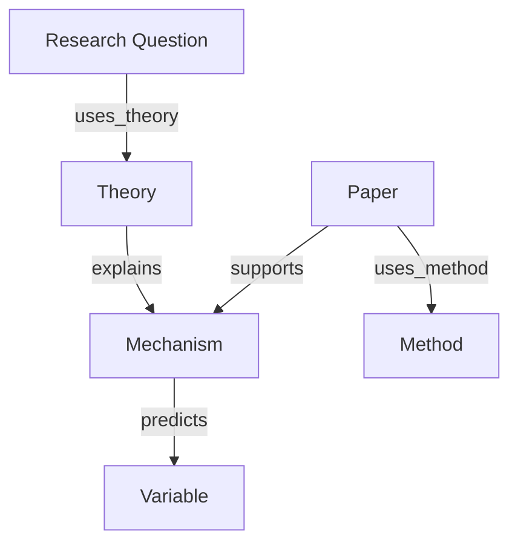

# Research Question Knowledge Graph

Use this skill to turn a literature set into a navigable knowledge graph centered on research questions.

## Core Rules

- Graph edges must be typed. Avoid vague links.
- Every paper node should have a Zotero key, DOI, or note link when available.
- Distinguish evidence from hypothesis, inference, and personal idea.
- Do not overstate gaps. A gap is valid only after checking nearby literature.

## Node Types

```text
paper
author
venue
theory
mechanism
construct
variable
method
dataset
measure
research_question
hypothesis
finding
limitation
project
idea
```

## Edge Types

```text
cites
supports
contradicts
uses_theory
tests_mechanism
measures
uses_method
uses_dataset
published_in
authored_by
extends
has_gap
informs_hypothesis
belongs_to_project
```

## Workflow

1. Define the focal research question.
2. Import papers from Zotero or Obsidian cards.
3. Extract nodes and typed edges.
4. Build three graph layers:
   - literature layer: papers, authors, venues, citations,
   - concept layer: theories, mechanisms, constructs, variables,
   - method layer: design, data, measures, analysis.
5. Identify graph patterns:
   - central theories,
   - underused methods,
   - missing measures,
   - overclaimed causal links,
   - disconnected but promising domains.
6. Export:
   - adjacency table,
   - Obsidian note links,
   - Mermaid graph,
   - gap list.

## Mermaid Template



## Output Template

```text
Focal research question:
Graph scope:

Nodes by type:
| Type | Count | Examples |

Key edges:
| Source | Edge | Target | Evidence |

Mermaid graph:

Gap candidates:
| Gap | Evidence | Verification needed |

Next reading/search actions:
```

## Beginner Prompt

```text
Use research-question-knowledge-graph to build a knowledge graph for my research question.
Use my Zotero papers and Obsidian paper cards as sources.
Return node tables, typed edges, a Mermaid graph, and gap candidates that require verification.
```

## Quality Check

- If an edge cannot be justified by a paper or note, mark it as an idea edge.
- If the graph is too dense, split it into theory, method, and evidence subgraphs.
